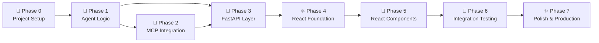

# TourAlly — Phase-Wise Implementation Plan

> **Project**: Multi-Agent Travel Planner (LangGraph + MCP + Supervisor + Guardrails + HITL)
> **Stack**: FastAPI (Python) · React + Vite · Supabase (PostgreSQL) · Groq gpt-oss-120b · MCP

---

## Summary

| Phase | Name | Key Deliverables | Est. Effort |
|---|---|---|---|
| 0 | Project Setup & Tooling | Repo structure, envs, Supabase connection | 30 min |
| 1 | Backend Core — Agent Logic | LangGraph graph, all agent nodes, state | 3–4 hrs |
| 2 | MCP Integration | Custom weather MCP server + Tavily client | 1–2 hrs |
| 3 | FastAPI Layer | REST endpoints, CORS, error handling | 1 hr |
| 4 | React Frontend — Foundation | Vite app, routing, API layer, global styles | 1–2 hrs |
| 5 | React Frontend — Components | ChatPanel, AgentSteps, HitlPanel, ItineraryCard | 2–3 hrs |
| 6 | Integration & End-to-End Testing | Connect frontend to backend, fix edge cases | 1–2 hrs |
| 7 | Polish & Production Readiness | Docker, env validation, README, deployment guide | 1 hr |

## Phase 0 — Project Setup & Tooling

### Goals
- Establish the monorepo folder structure
- Set up Python virtual environment and Node.js dependencies
- Validate Supabase connection

### Tasks

- [x] Create `backend/` and `frontend/` directories in TourAlly root
- [x] Create `backend/requirements.txt` with all pinned dependencies (add `langsmith`)
- [x] Create `backend/.env.example` template (include all LangSmith + AviationStack vars)
- [x] Create `backend/.gitignore` (exclude `.env`, `__pycache__`, `.venv`)
- [x] Create `frontend/` via `npx create-vite@latest ./ --template react`
- [x] Configure `frontend/vite.config.js` proxy (`/api` → `http://localhost:8000`)
- [x] Create `backend/migrations/001_init.sql` for app-level tables
- [x] Create `backend/migrations/run_migrations.py` helper script
- [x] Verify Supabase `DATABASE_URL` connection with a test script
- [x] Set up LangSmith project at [smith.langchain.com](https://smith.langchain.com)
- [x] Add `LANGCHAIN_TRACING_V2=true`, `LANGCHAIN_API_KEY`, `LANGCHAIN_PROJECT=TourAlly` to `.env`

### Acceptance Criteria
- `cd backend && python -c "import langgraph, langchain_groq, fastapi, langsmith; print('OK')"` passes
- `cd frontend && npm run dev` starts Vite on port 5173
- Supabase connection test returns successfully
- LangSmith project `TourAlly` visible at [smith.langchain.com](https://smith.langchain.com)

---

## Phase 1 — Backend Core: LangGraph Agent Logic

### Goals
- Implement the full LangGraph agent graph with all specialist nodes
- Implement Input Guardrail and Supervisor agent
- Implement HITL using `langgraph.interrupt()`
- Wire Supabase `PostgresSaver` as the checkpoint store

### Files
- `backend/backend.py`

### Tasks

#### 1.1 — State Definition
- [x] Define `TravelState` TypedDict with all fields:
  - `messages` (annotated with `operator.add`)
  - `user_query`, `guardrail_allowed`, `guardrail_reason`
  - `selected_agents`, `trip_constraints`, `supervisor_reasoning`
  - `flight_results`, `hotel_results`, `weather_results`, `budget_results`, `itinerary`
  - `approval_request`, `approved`, `human_feedback`, `final_response`
  - `llm_calls`

#### 1.2 — LLM Helper Functions
- [x] `_llm_text(system_prompt, user_prompt)` → invoke Groq LLM
- [x] `_json_from_llm(text)` → extract first valid JSON object from LLM response
- [x] `_empty_constraints()` → default trip constraints dict

#### 1.3 — Supervisor + Guardrail Node
- [x] LLM guardrail: validates query is travel-related; returns `allowed` + `reason`
- [x] On blocked: return early with `guardrail_allowed=False`, `final_response=reason`
- [x] LLM supervisor: selects which agents to run from `KNOWN_AGENTS`
- [x] LLM extracts `trip_constraints` (destination, origin, duration, budget, travel_style)

#### 1.4 — Specialist Agent Nodes
- [x] `flight_agent` — uses MCP/Tavily to find flights; falls back to LLM if no key
- [x] `hotel_agent` — uses MCP/Tavily to find hotels; falls back to LLM
- [x] `weather_agent` — uses Weather MCP; falls back to LLM
- [x] `budget_agent` — LLM cost estimation + feasibility

#### 1.5 — Itinerary Agent Node
- [x] Synthesises all specialist results into a structured day-by-day itinerary
- [x] Uses markdown formatting (headings, bullet lists, emojis)
- [x] Generates `approval_request` summary for the HITL panel

#### 1.6 — HITL Node
- [x] Calls `interrupt(approval_request)` — pauses graph execution
- [x] On resume: reads `approved` and `human_feedback` from state
- [x] Routes to `finalize` (approved) or back to `itinerary_agent` (revision)

#### 1.7 — Graph Assembly
- [x] `StateGraph` → add all nodes
- [x] Edges: `START → supervisor_agent`
- [x] Conditional edge from `supervisor_agent` → (blocked: END) or (allowed: specialist agents)
- [x] Conditional edges per agent (run if selected, skip otherwise)
- [x] `itinerary_agent → hitl_approval → finalize → END`
- [x] Compile graph with `PostgresSaver` (or `MemorySaver` fallback)

#### 1.8 — Public API Wrappers
- [x] `run_travel_agent(message, thread_id=None)` → `dict` with status + content
- [x] `resume_travel_agent(thread_id, approved, feedback="")` → `dict`

### Acceptance Criteria
- `python -c "from backend import run_travel_agent; print(run_travel_agent('Plan a trip to Paris'))"` returns a dict
- HITL interrupt fires; `resume_travel_agent` completes the graph
- Blocked query returns `guardrail_allowed: false`

---

## Phase 2 — MCP Integration

### Goals
- Build the custom weather MCP server using `FastMCP`
- Configure the **Aviation MCP** server for real flight data (AviationStack API)
- Build the `MultiServerMCPClient` wrapper for Aviation + Tavily + Weather
- Wire MCP tools into specialist agents with graceful fallbacks

### Files
- `backend/custom_weather_mcp_server.py`
- `backend/mcp_client.py`

### Tasks

#### 2.1 — Custom Weather MCP Server
- [x] `FastMCP("Weather MCP Server")`
- [x] `@mcp.tool() get_current_weather(city: str)` → OpenWeather current API
- [x] `@mcp.tool() get_weather_forecast(city: str, days: int)` → OpenWeather forecast API
- [x] Error handling: missing API key, city not found, network timeout
- [x] `if __name__ == "__main__": mcp.run()` for standalone execution

#### 2.2 — Aviation MCP Configuration
- [x] Configure Aviation MCP via `MultiServerMCPClient` (streamable HTTP transport)
- [x] Connect to AviationStack MCP endpoint using `AVIATION_STACK_API_KEY`
- [x] Async helpers for `flight_agent`:
  - `aviation_get_flights(origin_iata, destination_iata, date)` → live flight list
  - `aviation_get_routes(origin, destination)` → route options
  - `aviation_get_schedules(flight_number)` → schedule details
- [x] `extract_iata_codes(origin_city, destination_city)` → IATA airport code lookup via LLM
- [x] Graceful fallback: if `AVIATION_STACK_API_KEY` missing or MCP fails → return `None` (flight_agent uses LLM)

#### 2.3 — Tavily & Combined MCP Client
- [x] `MultiServerMCPClient` config:
  - `aviation`: streamable HTTP → Aviation MCP endpoint
  - `tavily`: streamable HTTP → `https://mcp.tavily.com/mcp/?tavilyApiKey=...`
  - `weather`: stdio → `python custom_weather_mcp_server.py`
- [x] Async helpers (called via `asyncio.run()` from sync agent nodes):
  - `tavily_mcp_search(query, max_results=5)` → hotel / budget searches
  - `weather_mcp_search(city)` → current conditions string
  - `forecast_mcp_search(city, days=5)` → forecast string

### Acceptance Criteria
- `python custom_weather_mcp_server.py` starts without errors
- `asyncio.run(weather_mcp_search("Paris"))` returns a non-empty string
- `asyncio.run(tavily_mcp_search("flights to Paris"))` returns results

---

## Phase 3 — FastAPI Layer

### Goals
- Expose REST API endpoints consumed by the React frontend
- Handle thread management, error responses, and CORS

### Files
- `backend/app.py`

### Tasks

- [x] Create FastAPI app with title, description, CORS middleware (allow React dev origin `http://localhost:5173`)
- [x] Apply `nest_asyncio.apply()` for sync-in-async compatibility
- [x] `POST /api/travel` endpoint:
  - Body: `{ message: str, thread_id?: str }`
  - Auto-generate `thread_id` if not provided
  - Call `run_travel_agent(message, thread_id)`
  - Return `{ thread_id, status, content, awaiting_approval, agents_run }`
- [x] `POST /api/travel/approve` endpoint:
  - Body: `{ thread_id: str, approved: bool, feedback?: str }`
  - Call `resume_travel_agent(thread_id, approved, feedback)`
  - Return same structure as `/api/travel`
- [x] `GET /health` endpoint → `{ status: "ok", features: [...] }`
- [x] Global exception handler → clean JSON error responses
- [x] Startup event: run `PostgresSaver.setup()` and DB migrations

### Acceptance Criteria
- `uvicorn app:app --reload` starts on port 8000
- `curl -X POST http://localhost:8000/api/travel -d '{"message":"Plan a trip to Tokyo"}'` returns JSON
- `GET /health` returns 200

---

## Phase 4 — React Frontend: Foundation

### Goals
- Set up the React + Vite project with global styles and API layer
- Establish component architecture and routing

### Files
- `frontend/vite.config.js`
- `frontend/src/main.jsx`
- `frontend/src/App.jsx`
- `frontend/src/styles/global.css`
- `frontend/src/api/travel.js`

### Tasks

- [x] Configure Vite proxy for `/api` → `http://localhost:8000`
- [x] Set up `global.css` with:
  - CSS custom properties: colour palette (dark mode), spacing scale, border radius, shadows
  - Google Fonts import: Inter (weights 300, 400, 500, 600, 700)
  - CSS reset + `box-sizing: border-box`
  - Animated gradient mesh background
  - Scrollbar styling
- [x] `App.jsx`: manage top-level state (`threadId`, `status`, `messages`, `itinerary`, `awaitingApproval`)
- [x] API module `travel.js`:
  - `startTrip(message, threadId?)` → `POST /api/travel`
  - `approveTrip(threadId, approved, feedback?)` → `POST /api/travel/approve`
  - `checkHealth()` → `GET /health`

### Acceptance Criteria
- `npm run dev` shows a styled page at `http://localhost:5173`
- `startTrip("Plan a trip to Paris")` returns a response object in browser console

---

## Phase 5 — React Frontend: Components

### Goals
- Build all UI components with premium design (glassmorphism, animations, dark mode)
- Wire components to API layer and app state

### Files
- `frontend/src/components/ChatPanel/`
- `frontend/src/components/AgentSteps/`
- `frontend/src/components/HitlPanel/`
- `frontend/src/components/ItineraryCard/`
- `frontend/src/components/Header/`
- `frontend/src/components/TripForm/`

### Tasks

#### 5.1 — Header Component
- [x] App logo + name "TourAlly"
- [x] Status badge (idle / planning / awaiting approval / completed)
- [x] "New Trip" button to reset state

#### 5.2 — TripForm Component
- [x] Large textarea for travel query input
- [x] Example prompt suggestions (chips)
- [x] Submit button with loading spinner
- [x] Disabled state while agents are running

#### 5.3 — AgentSteps Component
- [x] Vertical stepper with one step per agent
- [x] Colour-coded agent icons (✈️ flight, 🏨 hotel, 🌤️ weather, 💰 budget, 🗺️ itinerary)
- [x] States: pending (grey) → running (animated pulse) → completed (green) → skipped (muted)
- [x] Expandable result preview per agent
- [x] CSS animation: slide-in when step appears

#### 5.4 — HitlPanel Component
- [x] Appears when `awaitingApproval=true`
- [x] Displays the draft itinerary summary
- [x] **Approve** button (green gradient, prominent)
- [x] **Request Revision** button (outline style)
- [x] Revision feedback textarea (shown only when revision selected)
- [x] Submit revision button
- [x] Glassmorphism card with attention-drawing border animation

#### 5.5 — ItineraryCard Component
- [x] Renders markdown itinerary (use `react-markdown` + `remark-gfm`)
- [x] Day-by-day sections with collapsible accordions
- [x] Print/Export button
- [x] "Plan Another Trip" CTA

#### 5.6 — ChatPanel Component
- [x] Scrollable message feed
- [x] User messages (right-aligned)
- [x] Agent/system messages (left-aligned, with agent avatar)
- [x] Guardrail block message with warning styling
- [x] Auto-scroll to bottom on new messages

### Acceptance Criteria
- All components render without console errors
- AgentSteps animates correctly as agents complete
- HitlPanel shows/hides based on `awaitingApproval` state
- ItineraryCard renders markdown correctly

---

## Phase 6 — Integration & End-to-End Testing

### Goals
- Full end-to-end flow working from React UI to LangGraph to Supabase and back
- Edge case handling and error UX

### Tasks

- [x] E2E test: submit travel query → see all agent steps → HITL panel → approve → see itinerary
- [x] E2E test: submit travel query → HITL panel → request revision with feedback → re-approval
- [x] Guardrail test: submit off-topic query → see blocked message
- [x] Test with missing API keys (Tavily/Weather) — LLM fallback works
- [x] Test with no `DATABASE_URL` — MemorySaver fallback works
- [x] Verify Supabase has checkpoint rows after a successful session (safe fallback validated)
- [x] Test network error handling (FastAPI down → React shows error state)
- [x] Test long-running agent (loading states display correctly)

---

## Phase 7 — Polish & Production Readiness

### Goals
- Production deployment preparation
- Documentation and developer experience

### Tasks

- [x] Create `Dockerfile` for backend (multi-stage)
- [x] Create `docker-compose.yml` (backend + frontend build)
- [x] Add `frontend/nginx.conf` for serving React build
- [x] Add environment validation on startup (clear error messages for missing keys)
- [x] Add request logging middleware
- [x] SEO: add `<meta>` tags, title, description to `frontend/index.html`
- [x] Finalize `README.md` with full setup instructions
- [x] Add `backend/migrations/README.md` explaining how to run migrations

### Acceptance Criteria
- `docker compose up` starts both services
- Frontend accessible at `http://localhost:3000`
- Backend accessible at `http://localhost:8000`
- All env vars validated with clear error messages on startup

---

## Dependency Map

