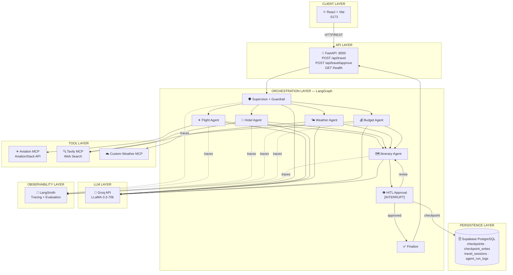
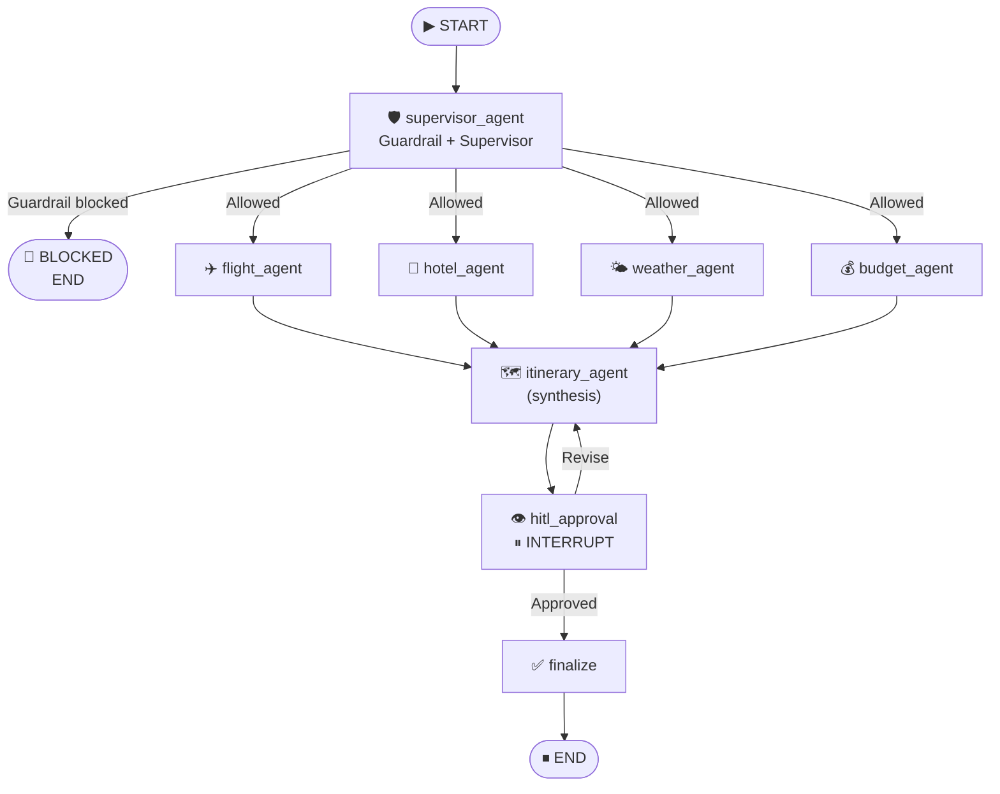
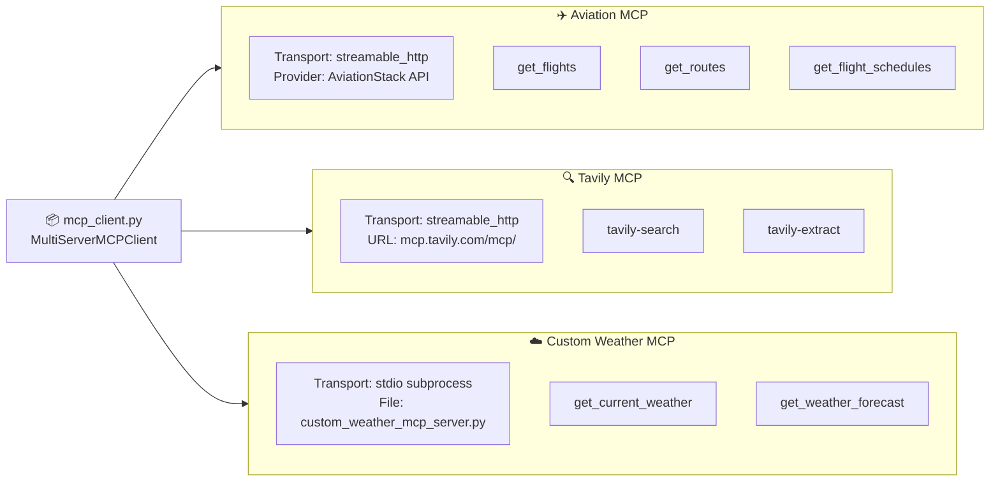
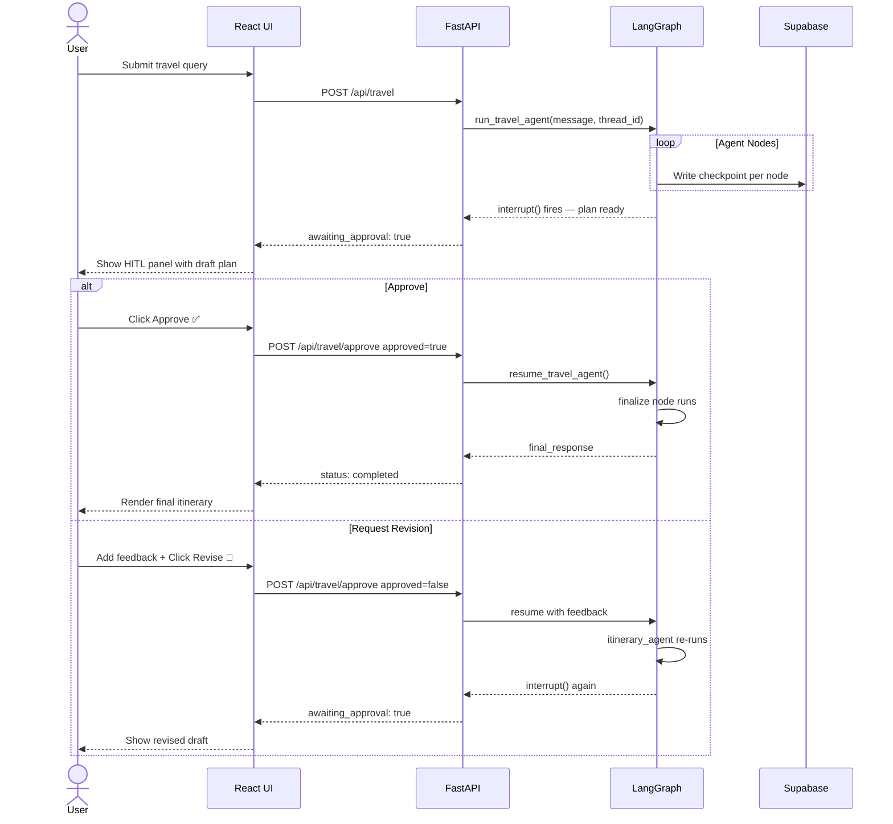
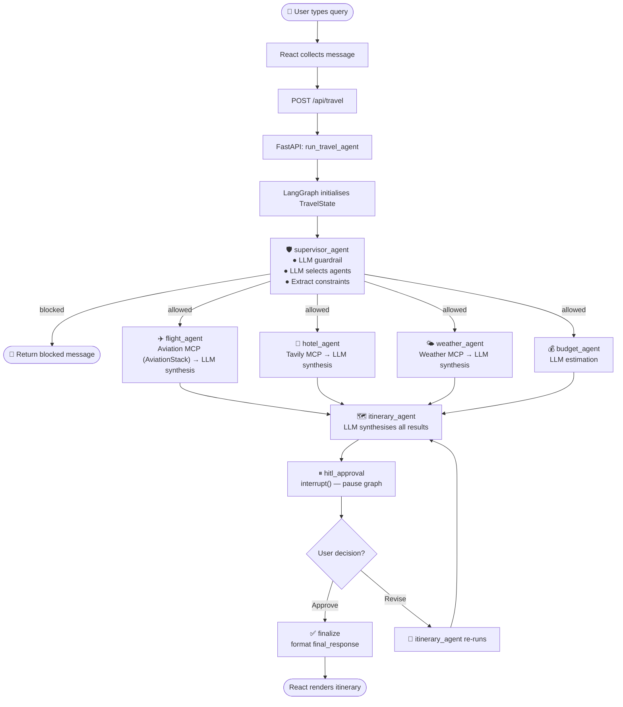
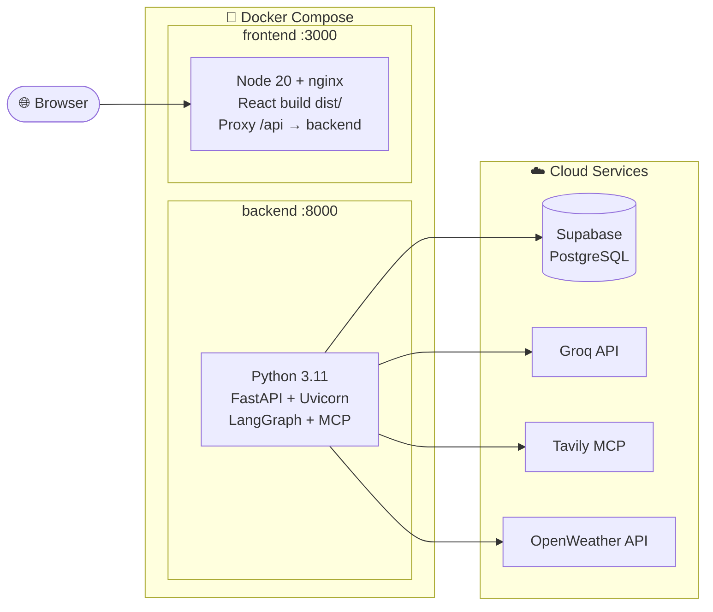
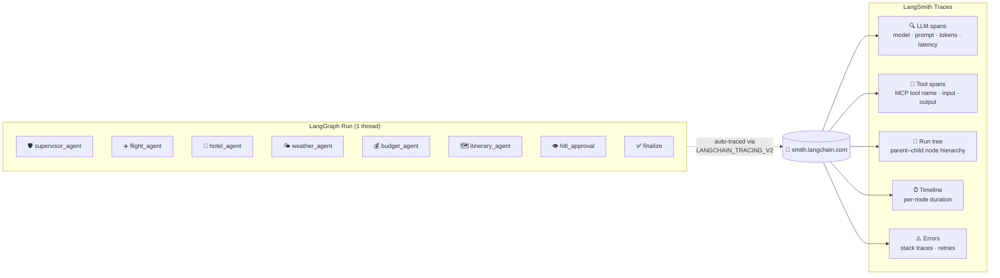

# TourAlly — System Architecture

> **Project**: Multi-Agent AI Travel Planner
> **Version**: 1.0.0
> **Stack**: FastAPI · React + Vite · LangGraph · MCP · Supabase · Groq LLaMA-3.3-70b · LangSmith

---

## 1. High-Level Architecture



---

## 2. LangGraph Agent Graph

### 2.1 Graph Flow Diagram



### 2.2 Agent Descriptions

| Agent | Role | Tools Used | LLM Calls |
|---|---|---|---|
| **supervisor_agent** | Validates query (guardrail) + selects agents + extracts constraints | None | 2 (guardrail + supervisor) |
| **flight_agent** | Finds real flights, routes, schedules, and airfare | **Aviation MCP** (AviationStack API) | 1 (synthesis) |
| **hotel_agent** | Finds accommodation options and neighbourhoods | Tavily MCP (web search) | 1 (synthesis) |
| **weather_agent** | Gets weather forecast for destination | Custom Weather MCP | 1 (synthesis) |
| **budget_agent** | Estimates total cost, checks feasibility | Tavily MCP (optional) | 1 |
| **itinerary_agent** | Synthesises all results into day-by-day plan | None | 1 (large prompt) |
| **hitl_approval** | Pauses graph, waits for human | None | 0 |
| **finalize** | Formats final output | None | 0 |

### 2.3 State Schema

```python
class TravelState(TypedDict, total=False):
    # Core
    messages: Annotated[list[AnyMessage], operator.add]
    user_query: str

    # Guardrail + Supervisor
    guardrail_allowed: bool
    guardrail_reason: str
    selected_agents: list[str]
    trip_constraints: dict[str, Any]
    supervisor_reasoning: str

    # Specialist results
    flight_results: str
    hotel_results: str
    weather_results: str
    budget_results: str
    itinerary: str

    # HITL
    approval_request: str
    approved: bool
    human_feedback: str

    # Output
    final_response: str
    llm_calls: int
```

---

## 3. MCP Architecture

### 3.1 Model Context Protocol Overview

MCP (Model Context Protocol) provides a standardised way for LLMs and agents to call external tools. TourAlly uses **three MCP servers**:



### 3.2 MCP Tool Mapping

| MCP Server | Tool | Used By Agent | API Key | Fallback |
|---|---|---|---|---|
| **Aviation MCP** | `get_flights` | flight_agent | `AVIATION_STACK_API_KEY` | LLM-only flight info |
| **Aviation MCP** | `get_routes` | flight_agent | `AVIATION_STACK_API_KEY` | LLM-only route info |
| **Aviation MCP** | `get_flight_schedules` | flight_agent | `AVIATION_STACK_API_KEY` | LLM-only schedule |
| Tavily | `tavily-search` | hotel_agent | `TAVILY_API_KEY` | LLM-only response |
| Tavily | `tavily-search` | budget_agent | `TAVILY_API_KEY` | LLM estimation |
| Custom Weather | `get_current_weather` | weather_agent | `OPENWEATHER_API_KEY` | LLM knowledge |
| Custom Weather | `get_weather_forecast` | weather_agent | `OPENWEATHER_API_KEY` | LLM knowledge |

---

## 4. API Design

### 4.1 REST Endpoints

#### `POST /api/travel`

Initiates a new travel planning session or resumes an existing thread.

**Request:**
```json
{
  "message": "Plan a 7-day trip to Tokyo from London with a $4000 budget",
  "thread_id": null
}
```

**Response — Planning in progress (agents still running):**
```json
{
  "thread_id": "550e8400-e29b-41d4-a716-446655440000",
  "status": "planning",
  "content": "Working on your travel plan...",
  "awaiting_approval": false,
  "agents_run": ["supervisor", "flight_agent", "hotel_agent"]
}
```

**Response — Awaiting human approval:**
```json
{
  "thread_id": "550e8400-e29b-41d4-a716-446655440000",
  "status": "awaiting_approval",
  "content": "Here's your draft travel plan for review...",
  "awaiting_approval": true,
  "agents_run": ["supervisor", "flight_agent", "hotel_agent", "weather_agent", "itinerary_agent"]
}
```

**Response — Guardrail blocked:**
```json
{
  "thread_id": "550e8400-e29b-41d4-a716-446655440000",
  "status": "blocked",
  "content": "TripMate AI can only help with travel-planning requests.",
  "awaiting_approval": false,
  "agents_run": ["supervisor"]
}
```

---

#### `POST /api/travel/approve`

Resumes a paused graph after human review.

**Request — Approve:**
```json
{
  "thread_id": "550e8400-e29b-41d4-a716-446655440000",
  "approved": true,
  "feedback": ""
}
```

**Request — Request Revision:**
```json
{
  "thread_id": "550e8400-e29b-41d4-a716-446655440000",
  "approved": false,
  "feedback": "Please include more budget accommodation options and a day trip to Mount Fuji."
}
```

**Response:**
```json
{
  "thread_id": "550e8400-e29b-41d4-a716-446655440000",
  "status": "completed",
  "content": "## Your Tokyo Adventure — 7 Days\n\n### Day 1: Arrival...",
  "awaiting_approval": false,
  "agents_run": []
}
```

---

#### `GET /health`

```json
{
  "status": "ok",
  "version": "1.0.0",
  "features": {
    "groq_llm": true,
    "tavily_mcp": true,
    "weather_mcp": true,
    "supabase_checkpointing": true
  }
}
```

---

## 5. Frontend Architecture

### 5.1 Component Tree

```mermaid
flowchart TD
    App["App.jsx\n(root state manager)"]
    Header["Header\nLogo · StatusBadge · NewTripButton"]
    TripForm["TripForm\nPromptChips · TextArea · SubmitButton"]
    ChatPanel["ChatPanel\nUserMessage · AgentMessage"]
    AgentSteps["AgentSteps"]
    AgentStep["AgentStep x6\nIcon · Name · Status · ResultPreview"]
    HitlPanel["HitlPanel\nDraftSummary · ApproveBtn · ReviseBtn · FeedbackForm"]
    ItineraryCard["ItineraryCard\nMarkdown · DayAccordions · ExportBtn"]

    App --> Header
    App --> TripForm
    App --> ChatPanel
    App --> AgentSteps --> AgentStep
    App --> HitlPanel
    App --> ItineraryCard

    style TripForm fill:#1a1a2e,stroke:#6c63ff
    style HitlPanel fill:#1a1a2e,stroke:#f5a623
    style ItineraryCard fill:#1a1a2e,stroke:#2ecc71
```



### 5.2 State Management

All state lives in `App.jsx` (lifted state pattern):

```javascript
// Thread identity
const [threadId, setThreadId] = useState(null);

// UI state machine
const [status, setStatus] = useState('idle');
// 'idle' | 'planning' | 'awaiting_approval' | 'completed' | 'blocked' | 'error'

// Agent execution tracking
const [agentSteps, setAgentSteps] = useState([]);
// [{ name, status: 'pending'|'running'|'completed'|'skipped', result }]

// Content
const [messages, setMessages] = useState([]);
const [itinerary, setItinerary] = useState('');
const [approvalDraft, setApprovalDraft] = useState('');
```

---

## 6. HITL (Human-In-The-Loop) Flow



---

## 7. Data Flow



---

## 8. Security Considerations

| Concern | Mitigation |
|---|---|
| API key exposure | Keys stored in `.env` (never committed); `.gitignore` excludes `.env` |
| Input injection | Guardrail LLM validates and sanitises intent before any tool calls |
| CORS | FastAPI CORS middleware allows only `http://localhost:5173` in dev |
| Rate limiting | Groq API has built-in rate limits; Tavily has per-key limits |
| DB credentials | Supabase connection string in `.env`; never hardcoded |
| Thread isolation | Each conversation keyed by unique `thread_id` (UUID v4) |

---

## 9. Deployment Architecture



---

## 10. Technology Stack Summary

| Layer | Technology | Version | Purpose |
|---|---|---|---|
| **LLM** | Groq LLaMA-3.3-70b | via API | All LLM inference |
| **Agent Graph** | LangGraph | 1.2.x | State machine + HITL |
| **LLM Framework** | LangChain | 1.3.x | LLM abstraction |
| **Observability** | LangSmith | via API | Tracing, evaluation, debugging |
| **Flight Data** | Aviation MCP (AviationStack) | via HTTP | Real flight routes & schedules |
| **MCP** | langchain-mcp-adapters | 0.3.x | Tool calling via MCP |
| **MCP Runtime** | mcp (FastMCP) | 1.28.x | Custom MCP server |
| **Web Search** | Tavily MCP | via HTTP | Hotel & budget search |
| **Weather** | OpenWeather API | v2.5 | Weather data |
| **API Server** | FastAPI | 0.136.x | REST API |
| **ASGI Server** | Uvicorn | 0.48.x | Production server |
| **Checkpointing** | langgraph-checkpoint-postgres | 3.1.x | HITL state persistence |
| **Database** | Supabase (PostgreSQL) | managed | Checkpoint + session store |
| **DB Driver** | psycopg[binary] | 3.3.x | Async PostgreSQL |
| **Frontend** | React | 18.x | UI framework |
| **Build Tool** | Vite | 5.x | Dev server + bundler |
| **Styling** | CSS Modules | — | Component-scoped CSS |
| **Fonts** | Google Fonts (Inter) | — | Typography |
| **Container** | Docker + Compose | — | Deployment |

---

## 11. LangSmith Observability

LangSmith provides end-to-end tracing for every LangGraph node execution, LLM call, and MCP tool invocation. No code changes are needed — it activates automatically when the env vars are set.

### 11.1 What LangSmith Traces



### 11.2 Environment Variables

```bash
# backend/.env
LANGCHAIN_TRACING_V2=true
LANGCHAIN_API_KEY=ls__...            # From smith.langchain.com
LANGCHAIN_PROJECT=TourAlly           # Groups all runs under one project
LANGCHAIN_ENDPOINT=https://api.smith.langchain.com  # Default — no change needed
```

### 11.3 What You Can Do in LangSmith

| Feature | Description |
|---|---|
| **Run Explorer** | Browse every agent run with full node-level trace tree |
| **LLM Spans** | See exact prompts sent to Groq, token counts, latency |
| **Tool Spans** | Inspect Aviation MCP, Tavily, and Weather MCP inputs/outputs |
| **HITL Traces** | See exactly where `interrupt()` fired and what state was saved |
| **Error Debugging** | Full stack traces when any agent node raises an exception |
| **Feedback** | Tag runs as good/bad for offline evaluation datasets |
| **Datasets & Evals** | Build evaluation sets from real traces to regression-test agents |

### 11.4 Setup Instructions

1. Sign up at [smith.langchain.com](https://smith.langchain.com) (free tier available)
2. Go to **Settings → API Keys** and create a new key
3. Add to `backend/.env`:
   ```bash
   LANGCHAIN_TRACING_V2=true
   LANGCHAIN_API_KEY=ls__your_key_here
   LANGCHAIN_PROJECT=TourAlly
   ```
4. Start the backend — traces appear automatically in the LangSmith dashboard
5. No SDK calls or decorators needed; LangGraph integrates natively
